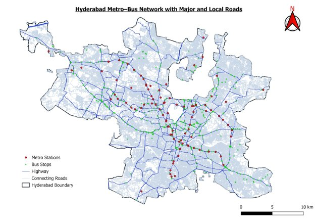
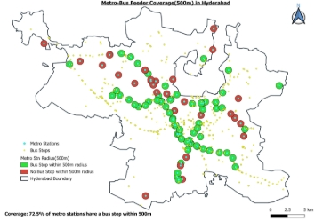
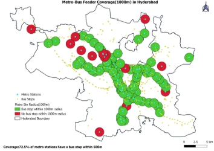
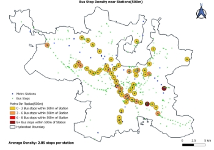
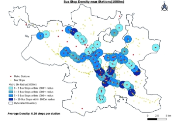

## **Hyderabad Metro–Bus Integration: A Spatial Assessment of Public Transport Connectivity**

**Introduction** 

Hyderabad, the capital of Telangana and India’s fourth-largest metropolis with over 11 million residents, has rapidly grown into a global IT hub. The Hyderabad Metro Rail (HMR) and Telangana State Road Transport Corporation (TSRTC) buses together form the backbone of the city’s public transport system. 

The Hyderabad Metro, inaugurated in 2017 under a Public–Private Partnership (PPP) model, spans nearly 69 km across three corridors. Complementing this, TSRTC operates more than 3,800 buses, providing airport as well as city-wide services. Given Hyderabad’s polycentric urban form with employment clusters in HITEC City, Gachibowli, and the Financial District, alongside the historic density of the Old City effective metro–bus integration is crucial for equitable, sustainable, and accessible mobility. 

This study employs GIS-based spatial analysis to evaluate connectivity between metro stations and bus stops, highlight feeder service gaps, and propose strategies for improving multimodal integration in Hyderabad.

## **Methodology**
**Data Sources** 

- OpenStreetMap (OSM): Metro stations, bus stops, and road networks 

**Software** 

- QGIS 3.40.10 

**Plugins Used** 

- QuickOSM: Data extraction 
- NNJoin: Nearest-neighbor analysis 
- QNEAT3: Network analysis 

**Analytical Tools** 

- **Buffer Analysis (500m, 1000m):** Assesses bus stop coverage around metro stations 
- **Nearest Neighbor Analysis:** Calculates distance from metro stations to closest bus stop 
- **Density Analysis:** Evaluates bus stop concentration per metro station buffer 
- **Network Analysis:** Estimates walking travel times at an assumed walking speed of 5 km/h 

**Findings** 

1. **Feeder Coverage** 

 

- **500m Coverage:** 116 of 160 stations (~72.5%) have at least one bus stop within 500m. 
- **1000m Coverage:** 138 stations (~86.25%) are covered within 1000m. 

**Spatial Trends:**

- Central corridor (Ameerpet, SR Nagar, Punjagutta) shows high integration. 
- The IT corridor (Raidurg–HITEC City) and peripheral terminals (Nagole, Miyapur) show weak feeder presence. 
- Coverage is spatially uneven, with dense stop distribution in central Hyderabad but large service gaps in peripheries and IT zones. 
2. ### **Distance to Nearest Bus Stop**
- **Average Distance:** 417.5 m 
- **Range:** 19.0 m (best case) to 2.97 km (worst case) 
- **Walking Time:** Average ~9.7 minutes 

**Interpretation:** 

- Central stations fall within comfortable walkable distances. 
- Peripheral and IT corridor stations require long detours (>10 min), discouraging transfers. 
3. **Bus Stop Density** 

 

- **500m Buffer:** 331 stops around 116 stations → 2.85 stops per station 
- **1000m Buffer:** 864 stops around 138 stations → 6.26 stops per station 

**Spatial Trends:** 

- Older corridors (Miyapur–LB Nagar) enjoy higher densities due to long-standing bus terminals. 
- The IT corridor and Old City remain underserved, with fewer than 3 stops per station on average. 
4. ### **Additional Observations** 
- **Centrality Bias:** Metro–bus integration is strongest in Hyderabad’s historic urban core but weak in newly developed corridors. 
- **Spatial Mismatch:** Rapidly expanding peripheral areas are not matched with feeder planning. 
- **Equity Gap:** Old City and peripheral residents face longer walking distances and fewer feeder options.
- **Ridership Impact:** Poor first- and last-mile access limits metro ridership and reinforces private vehicle dependence, particularly in IT corridors.
## **Summary of Key Findings![ 3]**

|**Metric** |**Result** |**Observation** |
| - | - | - |
|**Feeder Coverage (500m)** |~72.5% of stations |Central stations well covered; IT & peripheries weak |
|**Feeder Coverage (1000m)** |~86.25% of stations |Better accessibility, but many stops exceed walkable distance |
|**Average Distance to Nearest Stop** |~417.5 m (min 19 m, max 2.97 km) |Best integration at Punjagutta & SR Nagar; weakest at Raidurg & Nagole |
|**Bus Stop Density (500m)** |~3 stops/station |Adequate in older corridors; sparse in IT & Old City |
|**Bus Stop Density (1000m)** |~6.3 stops/station |Reasonable density, but uneven distribution |
|**Walking Travel Time** |Avg. ~9.7 min |
<5 min: 35% of stations; 5–10 min: majority; >10 min: IT 

& terminals 
|

**Recommendations** 

1. **Feeder Services** 
- Deploy branded “Metro Connect” buses at high frequencies. 
- Introduce mini-buses for the Old City’s narrow lanes. 
- Encourage employer-funded shuttles in IT corridors. 
2. **Pedestrian Infrastructure** 
- Covered walkways and skywalks at transfer hubs. 
- Universal design principles to support elderly and disabled commuters. 
3. **Technology Integration** 
- Unified multimodal travel app integrating Metro + TSRTC. 
- QR-based ticketing and a common mobility card across Metro, Bus, and MMTS. 
4. **Stop Relocation & Infrastructure** 
- Position bus stops closer to metro station plazas. 
- Develop sheltered feeder bays for seamless transfers. 
5. **Policy Tools** 
- Implement congestion pricing in IT corridors. 
- Mandate Transport Impact Assessments (TIAs) for new urban projects. 

**Conclusion** 
## This spatial assessment confirms that Hyderabad’s metro–bus integration is strong in central corridors but inadequate in the IT hubs, peripheries, and Old City. GIS-based coverage and density analysis reveal a central bias in feeder planning, leaving high-growth zones underserved. 
Bridging these gaps requires a coordinated approach: deploying targeted feeder services, enhancing pedestrian connectivity, leveraging digital integration, and enforcing policy tools. If implemented, these interventions could significantly reduce car dependence in IT corridors, boost metro ridership, and create a more equitable and sustainable public transport ecosystem for Hyderabad. 

**Author** 
Owais Farooqui - https:/github.com/Strik3r10

[ 1]: Aspose.Words.70be679f-a1d2-46fe-9723-6207cec7d15c.004.png
[ 2]: Aspose.Words.70be679f-a1d2-46fe-9723-6207cec7d15c.005.png
[ 3]: Aspose.Words.70be679f-a1d2-46fe-9723-6207cec7d15c.006.png
